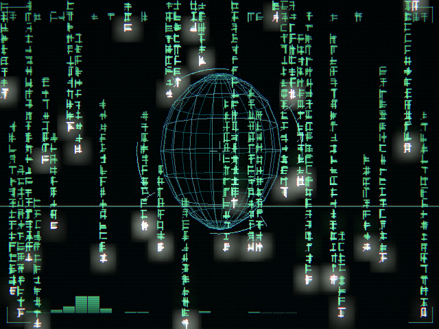
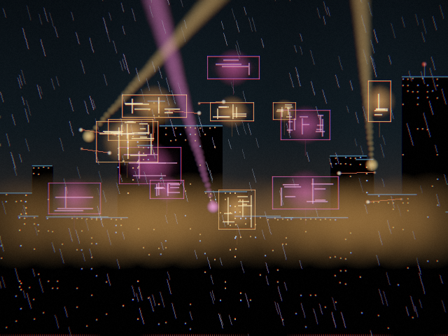
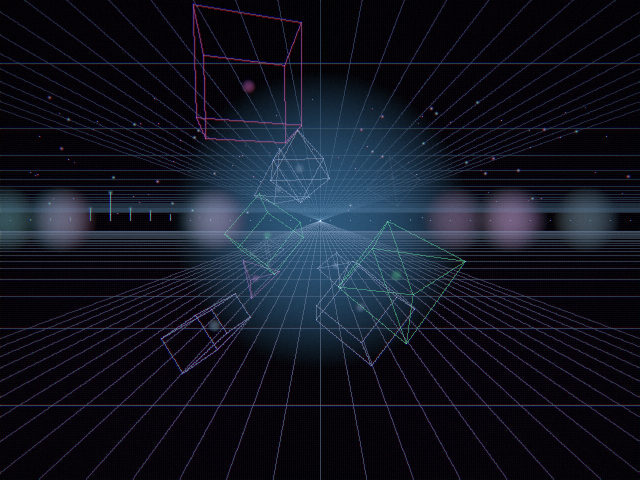
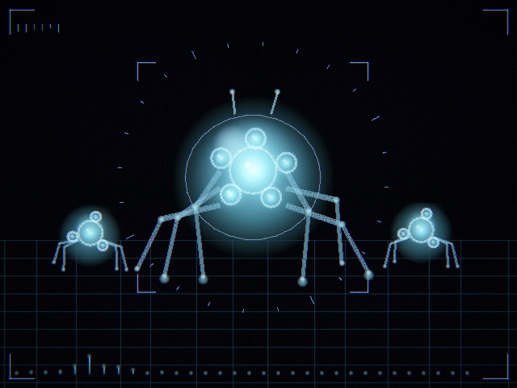

# veffects

**Turn an mp3 into real-time, math-only visuals.** `veffects` analyzes a track into a
compact `.veffects` "score" of audio features, then a cross-platform player renders
procedural scenes from it -- no textures, no assets, just code reacting to the music.
Every scene is a hot-loadable **plugin**, so the visual style is fully extensible.


<p align="center">
  
  <br>
  
  
</p>

## Features

- **mp3 -> visuals**, end to end: open a track in the GUI and it analyzes and plays.
- A tiny custom **`.veffects`** score format (~9.6 KB/s) -- see [docs/FORMAT.md](docs/FORMAT.md).
- **Plugin scenes** (`.dylib`/`.so`/`.dll`) discovered at runtime -- add your own by
  dropping a file in `plugins/`. See [docs/PLUGINS.md](docs/PLUGINS.md).
- Cross-platform **Dear ImGui** control panel: Open, scene dropdown, a **Mute original
  audio** toggle (watch the visuals silently), transport, and drag-and-drop of an mp3.
- Cinematic post-processing baked into the engine: bloom, chromatic aberration,
  beat-driven camera shake, film grain.
- Headless **offline render** mode that pipes raw frames to `ffmpeg` for an mp4.
- Builds on **macOS, Linux and Windows** via CMake; CI builds all three.

## Bundled scenes

| Scene | Look |
|-------|------|
| **Ghost in the Shell** | Green katakana digital rain, a wireframe cyber-skull in a HUD reticle, scanlines, beat glitch. |
| **Tachikoma** | The cute blue AI spider-tank: multi-lens eye cluster, articulated legs, cyan HUD. |
| **Blade Runner** | Rain-soaked neon megacity: glowing billboards, sweeping searchlights, flying-car streaks. |
| **Neuromancer** | Gibson's cyberspace: an endless data-grid flythrough with glowing wireframe constructs. |
| **Nirvana** | Magenta glitch dreamscape: corrupted grid, datamosh tears, digital decay. |

Scenes auto-crossfade over the track, or pick one from the dropdown (keys `1`-`9`,
`0` = auto).

## Build

Requires a C++17 compiler, CMake >= 3.16, and SDL2. Dear ImGui, tinyfiledialogs and
minimp3 are vendored in `third_party/`.

### macOS

```bash
brew install cmake sdl2
cmake -S . -B build -DCMAKE_BUILD_TYPE=Release
cmake --build build --parallel
```

### Linux

```bash
sudo apt-get install -y cmake libsdl2-dev   # Debian/Ubuntu
cmake -S . -B build -DCMAKE_BUILD_TYPE=Release
cmake --build build --parallel
```

### Windows

No system SDL2 needed -- fetch and build it as part of the configure step:

```bat
cmake -S . -B build -DVEFFECTS_FETCH_SDL=ON
cmake --build build --config Release --parallel
```

Outputs land in `build/bin/` (`veffects_gen`, `veffects_play`) and
`build/bin/plugins/` (the scene libraries).

## Usage

### GUI

```bash
./build/bin/veffects_play
```

Then **Open mp3...** (or drag an mp3 onto the window). It analyzes the track and
starts playing. Use the **Scene** dropdown to switch scenes and the **Mute original
audio** checkbox to run the visuals without sound. `Space` pauses, `M` mutes,
`Esc` quits.

### Command line

```bash
# analyze a track to a .veffects score
./build/bin/veffects_gen track.mp3 track.veffects

# play a score with synced audio, forcing a scene
./build/bin/veffects_play track.veffects --audio track.mp3 --scene-name "Blade Runner"

# or just hand the player the mp3 and let it analyze in-process
./build/bin/veffects_play track.mp3
```

### Offline render to mp4

```bash
./build/bin/veffects_play track.veffects --render --fps 30 --start 0 --end 60 \
    --scene-name "Ghost in the Shell" \
  | ffmpeg -f rawvideo -pix_fmt rgb24 -s 640x480 -r 30 -i - \
           -ss 0 -t 60 -i track.mp3 \
           -c:v libx264 -pix_fmt yuv420p -c:a aac -shortest out.mp4
```

`veffects_play --list-scenes` prints the scenes it can find.

## Repository layout

```
include/    veffects_format.h   .veffects structs + load/save
            veffects_plugin.h   plugin ABI (the scene contract)
            veffects_analyze.h  in-process mp3 -> features
src/        veffects_gen.cpp    CLI analyzer
            veffects_play.cpp   player / plugin host + ImGui GUI
plugins/    one .cpp per scene  (built into build/bin/plugins/)
third_party/ imgui, tinyfiledialogs, minimp3 (vendored)
docs/       FORMAT.md, PLUGINS.md, screenshots
.github/    CI workflow (macOS + Linux + Windows)
```

## Writing your own scene

See [docs/PLUGINS.md](docs/PLUGINS.md). In short: implement four C functions, draw
into an additive HDR buffer with the provided primitives, multiply by `p->alpha`,
and derive motion from `p->time`. Drop the `.cpp` in `plugins/`, rebuild, and it
appears in the dropdown.

## License

MIT -- see [LICENSE](LICENSE). Bundled third-party code keeps its own licenses
(Dear ImGui: MIT, minimp3: CC0, tinyfiledialogs: zlib).
